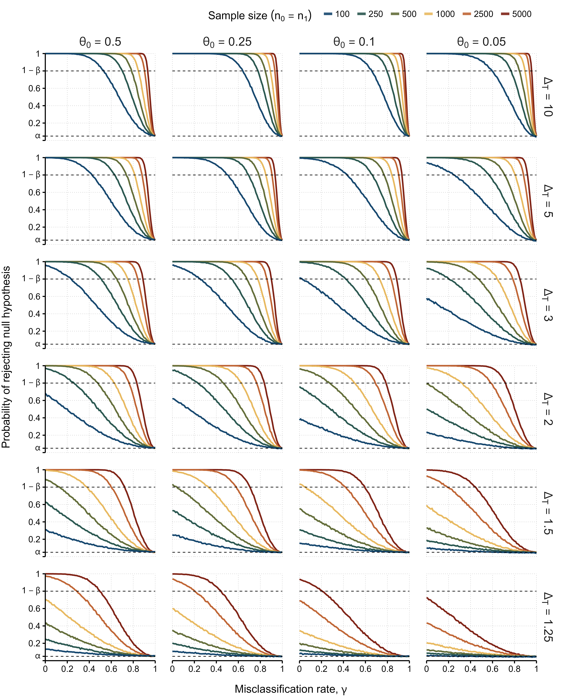
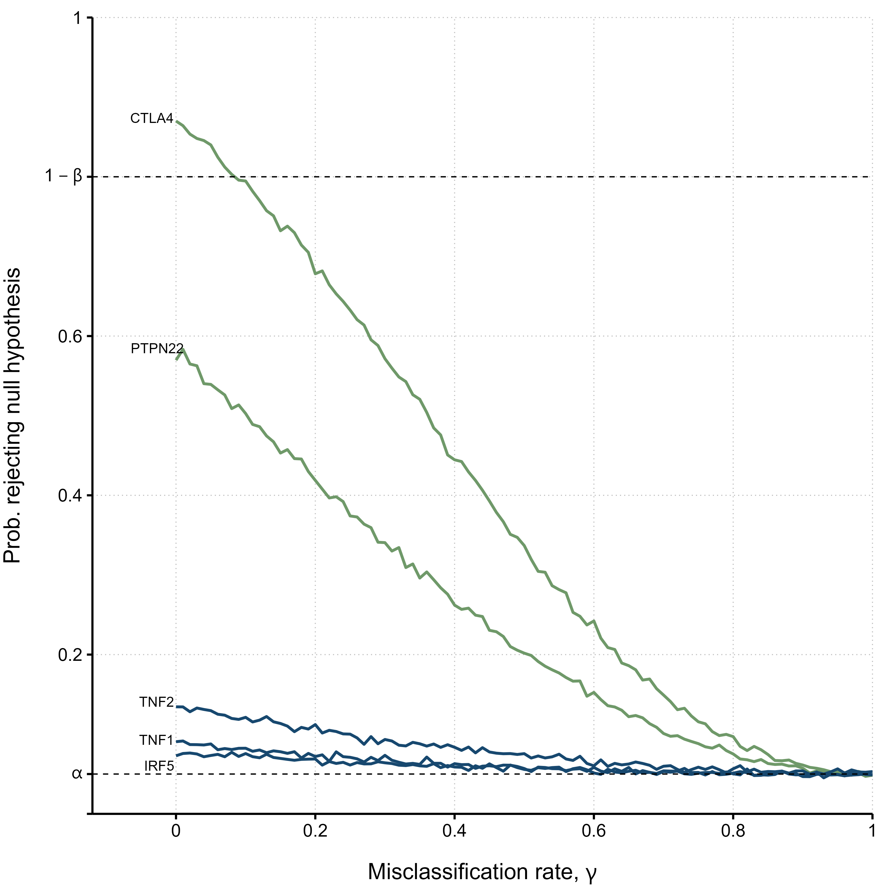

# Impact of Imperfect Diagnosis in ME/CFS Association Studies

[]()
[](https://github.com/jtmalato/misclassification-simulations/blob/main/LICENSE)

## Publication

* 📃 Preprint: 
* 📝 Peer reviewed publication: 

## Code and data

* [scripts](scripts) folder contains the code R used to generate hypothetical and real-life data, run the simulations, and create the article's results (such as Figure 1 and Figure 3A, shown below).
* [data](data) folder contains original data from real-life studies and files to generate Tables 3 and 4.
* [data-cluster](data-cluster/no-correction) folder contains the simulation results used.
* [figures](figures) folder contains all the figures produced (formats: png with and without background, and pdf).


<!--  -->


## Report issues

Please add an issue or notify the authors should you find any error to correct or improvement to make.
Well-documented pull requests are particularly appreciated.

## How to cite

> Malato, J., Graça, L., Sepúlveda, N. (2022).

```
@Article{Malato2021,
   title     = {Impact of Imperfect Diagnosis in ME/CFS Association Studies},
   volume    = {},
   url       = {},
   DOI       = {},
   number    = {},
   journal   = {},
   publisher = {},
   author    = {João Malato and Luís Graça and Nuno Sepúlveda},
   editor    = {},
   year      = {2022},
   month     = {},
   pages     = {}
}
```
